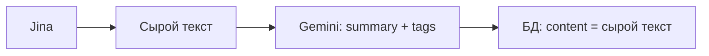
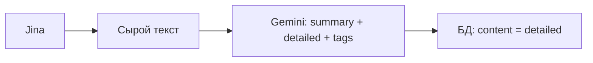

# Сохранение AI-пересказа вместо сырого контента

## Текущий поток

## Целевой поток

---

## 1. [src/app/actions.ts](src/app/actions.ts)

**Изменения:**

- Расширить промпт: добавить запрос поля `detailed` (подробный структурированный пересказ).
- Изменить возвращаемый тип на `{ summary, detailed, tags }`.
- Добавить fallback: при ошибке или пустом `detailed` возвращать `content.slice(0, 10000)`.

**Новый промпт (JSON с тремя полями):**

- `summary` — краткая суть, 3–5 пунктов.
- `detailed` — подробный пересказ: ключевые идеи, без навигации и меню, на русском, с абзацами, до ~3000 слов.
- `tags` — 3–7 тегов на английском.

**Уровень детализации:** medium (как статья). При необходимости его можно вынести в параметр функции.

---

## 2. [src/app/api/capture/route.ts](src/app/api/capture/route.ts)

**Изменения (строки ~149–179):**

- Деструктурировать `{ summary, detailed, tags }` вместо `{ summary, tags }`.
- Если `content.length <= 30` — не вызывать Gemini, использовать `detailed: content` (og:fallback).
- Вычислять `readingTimeMin` от итогового контента (detailed или content).
- Сохранять в БД `content: finalContent`, где `finalContent = detailed` при вызове Gemini, иначе `content`.
- Удалить `console.log("CONTENT LENGTH:", ...)` при наличии.

---

## 3. Fallback-логика

| Условие                | Поведение                                                           |
| ---------------------- | ------------------------------------------------------------------- |
| `content.length > 30`  | Вызов `generateSummaryAndTags` → сохраняем `detailed` как `content` |
| `content.length <= 30` | Пропуск Gemini → сохраняем `content` (og:description и т.п.)        |
| Ошибка Gemini          | `detailed = content.slice(0, 10000)`                                |

---

## 4. Опционально (не в текущем плане)

- Двухступенчатая обработка для больших текстов: сжатие → пересказ.
- Параметр уровня детализации (medium / deep / ultra) в `generateSummaryAndTags`.

